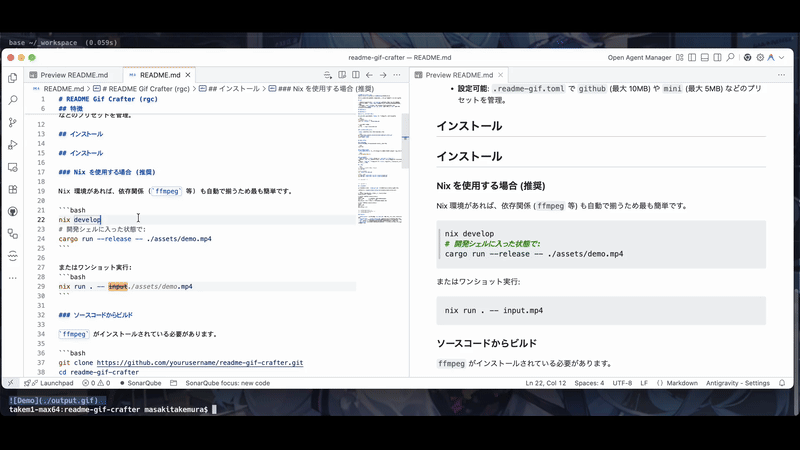

# README Gif Crafter (rgc)

A CLI tool to craft optimized GIF demos for your READMEs from MP4 recordings.

## Demo Screen


## Features

- **Simple Defaults**: Just run `rgc input.mp4` to get a standard 800px width GIF.
- **Optimized**: Uses `ffmpeg` with palette generation for high-quality, low-size GIFs.
- **Markdown Ready**: Outputs the precise Markdown snippet to copy-paste.
- **Configurable**: Use presets like `github` (max 10MB) or `mini` (max 5MB) via `.readme-gif.toml`.

## Installation

## Installation

### Using Nix (Recommended)

Nix provides the simplest setup as it automatically handles dependencies like `ffmpeg`.

```bash
nix develop
# Inside the dev shell:
cargo run --release -- ./assets/demo.mp4
```

Or run directly:
```bash
nix run . -- input.mp4
```

### From Source

Requires `ffmpeg` to be installed on your system.

```bash
git clone https://github.com/yourusername/readme-gif-crafter.git
cd readme-gif-crafter
cargo install --path .
```

## Development & Testing

### Running Tests
To run all tests:

```bash
cargo test
```

### Automating Demo Updates
Use `script/update-demo.sh` to regenerate the demo and update READMEs automatically:

```bash
./script/update-demo.sh
```

### Environment
- **Rust Version**: `1.82.0` (Pinned via `.mise.toml` & `flake.nix`)
- **Mise**: If using `mise`, version is automatically pinned.
- **Nix**: `flake.nix` provides the same version (`1.82.0`), ensuring consistency.

## Usage

```bash
# Basic usage (defaults to 800px width, 15fps)
rgc demo.mp4

# With preset
rgc --preset mini demo.mp4

# Custom usage
rgc demo.mp4 --width 1024 --fps 30 --output my-demo.gif
```

<!-- rgc:start -->


<!-- rgc:end -->

## Configuration

Create a `.readme-gif.toml` in your project root to manage presets.

**Example**: [examples/sample-config.toml](examples/sample-config.toml)

```toml
# The preset used when no --preset is specified
default_preset = "github"

# Define a preset named "github"
[github]
width = 800         # Resize width (maintain aspect ratio)
fps = 15            # Frame rate
max_size_mb = 10.0  # (Planned) Target file size in MB

# Define another preset named "mini"
[mini]
width = 480
fps = 12
max_size_mb = 5.0
```

<!-- config-demo:start -->
<!-- Config demo placeholder -->
<!-- config-demo:end -->

### Fields

- `default_preset`: The name of the preset to use when running `rgc input.mp4` without flags.
- `[section_name]`: Defines the preset name used in `--preset section_name`.
- `width`: Width in pixels. Height is calculated automatically.
- `fps`: Frames per second. Lower values reduce file size significantly.
- `max_size_mb`: Target file size. The tool will adjust quality to try to fit this limit (Logic currently in development).

## Roadmap & TODO

- [ ] **Windows Support**: Currently verified on macOS/Linux.
- [ ] **Advanced Optimization**: Improve `max_size_mb` logic with bitrate adjustments.
- [ ] **Interactive Mode**: TUI for selecting crop areas interactively.
- [ ] **Preview**: Ability to preview settings before generation.

## License

MIT License